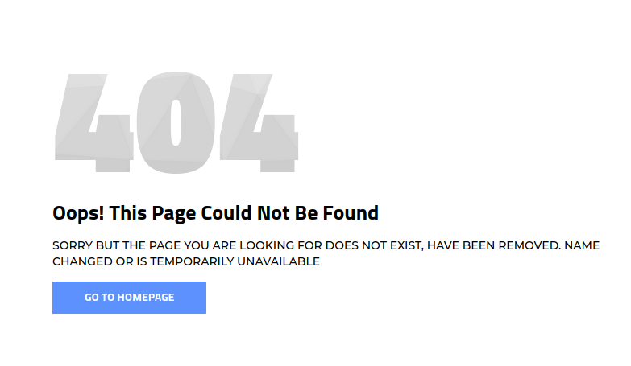
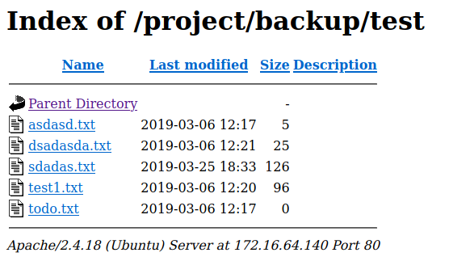
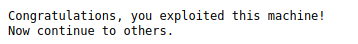

# 172.16.64.140

Nmap scan report for 172.16.64.140
Host is up (0.10s latency).
Not shown: 999 closed ports
PORT   STATE SERVICE VERSION
80/tcp open  http    Apache httpd 2.4.18 ((Ubuntu))
|_http-server-header: Apache/2.4.18 (Ubuntu)
|_http-title: 404 HTML Template by Colorlib

Only having port 80 would indicate this is just a web server and nothing more. Checking out port 80 gives us a 404 error page. 


Let's gobuster the site for directories. 
```
gobuster dir -u 172.16.64.140 -w /opt/SecLists/Discovery/Web-Content/directory-list-2.3-small.txt -r
===============================================================
Gobuster v3.1.0
by OJ Reeves (@TheColonial) & Christian Mehlmauer (@firefart)
===============================================================
[+] Url:                     http://172.16.64.140
[+] Method:                  GET
[+] Threads:                 10
[+] Wordlist:                /opt/SecLists/Discovery/Web-Content/directory-list-2.3-small.txt
[+] Negative Status codes:   404
[+] User Agent:              gobuster/3.1.0
[+] Follow Redirect:         true
[+] Timeout:                 10s
===============================================================
2021/08/18 11:57:10 Starting gobuster in directory enumeration mode
===============================================================
/img                  (Status: 200) [Size: 932]
/project              (Status: 401) [Size: 460]
/css                  (Status: 200) [Size: 932]
```

`/project` looks interesting. Going to the site we are prompted for credentials, immediate thought is `admin:admin` which worked. 

Now that we have creds, let's gobuster again authenticated as such:
```
gobuster dir -u 172.16.64.140/project -w /opt/SecLists/Discovery/Web-Content/directory-list-2.3-small.txt -r -U admin -P admin
===============================================================
Gobuster v3.1.0
by OJ Reeves (@TheColonial) & Christian Mehlmauer (@firefart)
===============================================================
[+] Url:                     http://172.16.64.140/project
[+] Method:                  GET
[+] Threads:                 10
[+] Wordlist:                /opt/SecLists/Discovery/Web-Content/directory-list-2.3-small.txt
[+] Negative Status codes:   404
[+] User Agent:              gobuster/3.1.0
[+] Auth User:               admin
[+] Follow Redirect:         true
[+] Timeout:                 10s
===============================================================
2021/08/18 12:04:20 Starting gobuster in directory enumeration mode
===============================================================
/images               (Status: 200) [Size: 5874]
/css                  (Status: 200) [Size: 1146]
/includes             (Status: 403) [Size: 304] 
/backup               (Status: 200) [Size: 6525]
```

Going to `/backup` just takes us back to `/project` - let's do another gobuster here
```
gobuster dir -u 172.16.64.140/project/backup -w /opt/SecLists/Discovery/Web-Content/directory-list-2.3-small.txt -r -U admin -P admin
===============================================================
Gobuster v3.1.0
by OJ Reeves (@TheColonial) & Christian Mehlmauer (@firefart)
===============================================================
[+] Url:                     http://172.16.64.140/project/backup
[+] Method:                  GET
[+] Threads:                 10
[+] Wordlist:                /opt/SecLists/Discovery/Web-Content/directory-list-2.3-small.txt
[+] Negative Status codes:   404
[+] User Agent:              gobuster/3.1.0
[+] Auth User:               admin
[+] Follow Redirect:         true
[+] Timeout:                 10s
===============================================================
2021/08/18 12:15:03 Starting gobuster in directory enumeration mode
===============================================================
/images               (Status: 200) [Size: 5895]
/css                  (Status: 200) [Size: 1167]
/test                 (Status: 200) [Size: 1771]
```
Checking out `/test`


Checking each of the text files we find a mysql string in `sdadas.txt`
```
Driver={SQL Server};Server=foosql.foo.com;Database=;Uid=fooadmin;Pwd=fooadmin;
/var/www/html/project/354253425234234/flag.txt
```

Hitting this url gives us our flag
