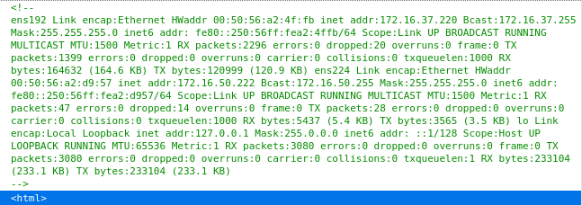

# 172.16.37.220
```
Nmap scan report for 172.16.37.220
Host is up (0.10s latency).
Not shown: 999 closed ports
PORT   STATE SERVICE VERSION
80/tcp open  http    Apache httpd 2.4.18 ((Ubuntu))
|_http-server-header: Apache/2.4.18 (Ubuntu)
|_http-title: Site doesn't have a title (text/html; charset=UTF-8).
```

Only port 80 open so we check it out only to be presented with a blank white screen. If we check inspect element we see some commented `ipconfig` information


Banner grabbing with nc fails
```
nc 172.16.37.220 80
HEAD / HTTP/1.0

HTTP/1.1 400 Bad Request
Date: Thu, 19 Aug 2021 15:06:03 GMT
Server: Apache/2.4.18 (Ubuntu)
Content-Length: 301
Connection: close
Content-Type: text/html; charset=iso-8859-1

<!DOCTYPE HTML PUBLIC "-//IETF//DTD HTML 2.0//EN">
<html><head>
<title>400 Bad Request</title>
</head><body>
<h1>Bad Request</h1>
<p>Your browser sent a request that this server could not understand.<br />
</p>
<hr>
<address>Apache/2.4.18 (Ubuntu) Server at 127.0.1.1 Port 80</address>
</body></html>
```

#### Turns out this machine is compromised on the `172.16.50.222` ip via the `.234` host via SSH and metasploits `autoroute` module